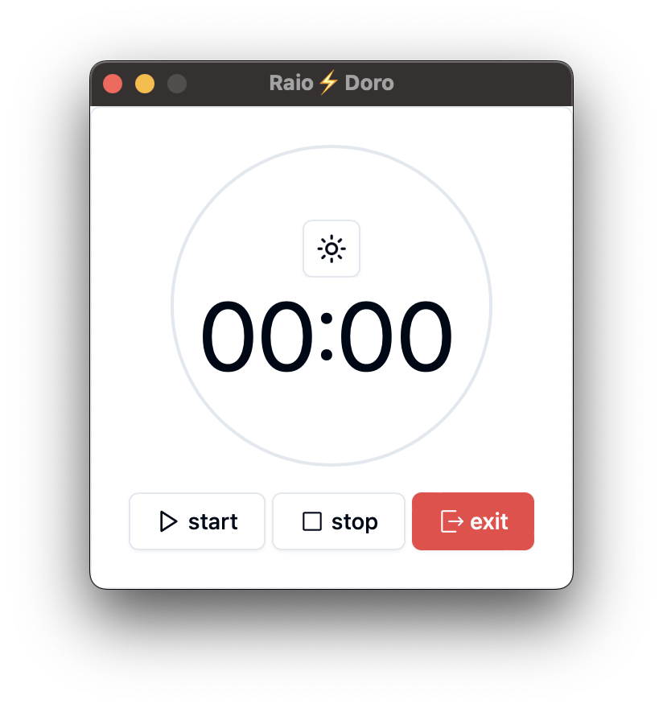

# Raio⚡️Doro | Pomodoro App v0.1.3

[ macos (✅) - windows(✅) - ubuntu(👨🏾‍🔧)]

O Raio⚡️Doro App é uma ferramenta de gerenciamento de tempo baseada na técnica de produtividade Pomodoro. Ele permite aos usuários dividir seu trabalho em intervalos de tempo focados, conhecidos como "pomodoros", separados por breves pausas. Este aplicativo é uma implementação moderna dessa técnica, desenvolvida usando a biblioteca React.

## Recursos Principais

- **Temporizador Pomodoro Interativo:** Os usuários podem definir e iniciar um temporizador Pomodoro. O temporizador exibe contagem regressiva em formato de horas e minutos. Botões intuitivos permitem iniciar, pausar e parar o temporizador.

- **Funcionalidade de Pausa e Parada:** Os usuários têm a opção de pausar e retomar o temporizador durante uma sessão Pomodoro. Eles podem interromper completamente a sessão Pomodoro e reiniciar o temporizador.

- **Integração com Diálogos de Confirmação:** Antes de parar ou sair do temporizador, o aplicativo exibe um diálogo de confirmação. Isso ajuda a evitar a interrupção acidental de uma sessão de trabalho em andamento.

- **Personalização do Tema:** Os usuários podem alternar entre temas claro e escuro usando um botão de alternância de tema.

- **Design Responsivo:** O aplicativo é projetado para ser responsivo e funcionar bem em diferentes tamanhos de tela e dispositivos.

## Tecnologias Utilizadas

- React
- Lucide-react
- Radix-ui/react-icons
- Tauri

## Como Contribuir

Os desenvolvedores interessados em contribuir para o projeto podem fazer fork do repositório, implementar melhorias e enviar solicitações pull.

## Licença

Este aplicativo é distribuído sob a licença MIT. Consulte o arquivo LICENSE para obter mais detalhes.

## Autor

[Alan Ramalho]

## Versão atual

[0.1.3] - 07/03/2024

## Notas de Lançamento

### Versão 0.1.3
- **Novo Recurso:** Ao abrir o app pela primeira vez o app questiona sobre permissoes. [👨🏾‍🔧]
- **Novo Recurso:** Github actions - step 2 - cargo, rust, tauri build. [✅] 
- **Novo Recurso Visual:** Novo icone do app. [✅]
- **Novo Recurso:** Github actions - step 1 - nodejs yarn & vite build. [✅]
- **Correção de Bug:** Ajustado a notificação ao término do pomodoro.  [👨🏾‍🔧]
- **Correção de Bug:** Ao recusar fechar a aplicação o app era finalizado. [✅]
- **Correção de Bug:** Detalhes visuais no titulo corrigidos. [✅]

### Versão 0.1.2 - 06/03/2024
- **Correção de Bug:** Detalhes visuais no tema dark foram corrigidos. [✅]
- **Novo Recurso:** Adicionada notificação ao término do pomodoro. [✅]

### Versão 0.1.1 - 06/03/2024
- **Correção de Bug:** Detalhes visuais no tema dark foram ajustados. [✅]
